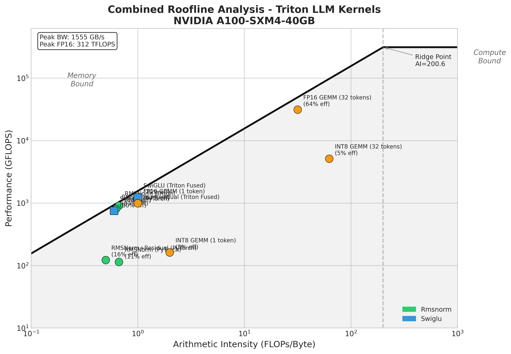

# triton-kernels

High-performance GPU kernels for LLM inference, implemented in [OpenAI Triton](https://triton-lang.org/).

This repository provides educational, well-documented implementations of common transformer operations optimized for inference. Each kernel includes roofline analysis explaining *why* the optimization works at the hardware level.

## Why Custom Kernels?

LLM inference is **memory-bandwidth bound**. A 7B parameter model in FP16 requires loading 14GB of weights for every forward pass. On an A100 (2TB/s bandwidth), this takes ~7ms—while the actual computation is <0.1ms.

Custom kernels help by:

- **Fusing operations** to reduce memory round-trips
- **Quantizing weights** to reduce memory traffic
- **Maximizing bandwidth utilization** through memory-aware access patterns

## Kernels

| Kernel | Description | Speedup vs PyTorch |
|--------|-------------|-------------------|
| [`rmsnorm`](triton_kernels/rmsnorm.py) | RMSNorm with FP32 accumulation | **8.1x** |
| [`rmsnorm_residual_fused`](triton_kernels/rmsnorm.py) | Fused RMSNorm + residual add | **6.0x** |
| [`swiglu_fused`](triton_kernels/swiglu.py) | Fused SiLU-gated linear unit | **1.6x** |
| [`int8_gemm`](triton_kernels/quantized_matmul.py) | W8A16 quantized matrix multiply | ~1.0x (2x memory savings) |

## Installation

```bash
# Clone the repository
git clone https://github.com/bassrehab/triton-kernels.git
cd triton-kernels

# Install in development mode
pip install -e .

# Or with all dependencies (testing + benchmarking)
pip install -e ".[all]"
```

**Requirements:**
- Python 3.10+
- PyTorch 2.0+
- Triton 2.1+
- NVIDIA GPU (compute capability 7.0+)

## Quick Start

```python
import torch
from triton_kernels import (
    rmsnorm,
    rmsnorm_residual_fused,
    swiglu_fused,
    int8_gemm,
    quantize_weight_per_channel,
)

# ==============================================================================
# Fused RMSNorm + Residual
# ==============================================================================
# Common pattern in transformer blocks: normalize(x + residual)
x = torch.randn(1, 2048, 4096, device='cuda', dtype=torch.float16)
residual = torch.randn_like(x)
weight = torch.ones(4096, device='cuda', dtype=torch.float16)

# Fused: avoids materializing x + residual intermediate tensor
y = rmsnorm_residual_fused(x, residual, weight, eps=1e-6)

# ==============================================================================
# Fused SwiGLU
# ==============================================================================
# Used in LLaMA, Mistral, and other modern LLMs
gate = torch.randn(1, 2048, 11008, device='cuda', dtype=torch.float16)
up = torch.randn_like(gate)

# Fused: silu(gate) * up in one kernel
y = swiglu_fused(gate, up)

# ==============================================================================
# INT8 Quantized GEMM
# ==============================================================================
# W8A16: INT8 weights, FP16 activations (2x memory reduction for weights)
x = torch.randn(1, 2048, 4096, device='cuda', dtype=torch.float16)
weight_fp16 = torch.randn(11008, 4096, dtype=torch.float16)

# Quantize weights (typically done once at load time)
weight_int8, scale = quantize_weight_per_channel(weight_fp16)
weight_int8 = weight_int8.cuda()
scale = scale.cuda()

# INT8 GEMM with on-the-fly dequantization
y = int8_gemm(x, weight_int8, scale)
```

## Drop-in Modules

For easy integration with existing models:

```python
from triton_kernels import TritonRMSNorm, SwiGLU, Int8Linear

# Replace torch.nn.RMSNorm
norm = TritonRMSNorm(hidden_size=4096, eps=1e-6).cuda()

# Replace F.silu(gate) * up
activation = SwiGLU()

# Replace nn.Linear with INT8 quantized version
linear = Int8Linear.from_linear(pretrained_linear_layer)
```

## Benchmarks

Run benchmarks on your hardware:

```bash
# Individual kernels
python -m benchmarks.bench_rmsnorm
python -m benchmarks.bench_swiglu
python -m benchmarks.bench_quantized_matmul

# Full roofline analysis (generates plots and analysis doc)
python -m benchmarks.full_roofline --output-dir docs/figures
```

### Benchmark Results (A100-SXM4-40GB)

Tested with LLaMA 7B-style dimensions (hidden_dim=4096, ffn_dim=11008, seq_len=2048).

| Kernel | Latency (ms) | Bandwidth (GB/s) | % of Peak | Speedup |
|--------|-------------|------------------|-----------|---------|
| RMSNorm (PyTorch) | 0.30 | 168 | 11% | 1.0x |
| RMSNorm (Triton) | 0.04 | 1365 | 88% | **8.1x** |
| RMSNorm+Residual (PyTorch) | 0.32 | 266 | 17% | 1.0x |
| RMSNorm+Residual (Triton Fused) | 0.05 | 1285 | 83% | **6.0x** |
| SwiGLU (PyTorch) | 0.18 | 1251 | 80% | 1.0x |
| SwiGLU (Triton Fused) | 0.11 | 1223 | 79% | **1.6x** |
| FP16 GEMM (cuBLAS) | 0.76 | 200 | - | 1.0x |
| INT8 GEMM (Triton) | 0.09 | 480 | 31% | ~1.0x |
| INT8 GEMM (cuBLAS, M=2048) | 0.73 | 146 | - | **1.04x** |

*Peak bandwidth: 1555 GB/s. INT8 GEMM provides 2x memory savings for weights.*

## Roofline Analysis



The roofline model shows where each kernel sits relative to hardware limits:

- **Below the diagonal**: Memory-bound (benefit from fusion/quantization)
- **On the plateau**: Compute-bound (benefit from faster arithmetic)

Most LLM inference operations are memory-bound, which is why our optimizations focus on reducing memory traffic rather than raw FLOPS.

See [docs/ROOFLINE_ANALYSIS.md](docs/ROOFLINE_ANALYSIS.md) for detailed analysis and [docs/INT8_GEMM_INVESTIGATION.md](docs/INT8_GEMM_INVESTIGATION.md) for the INT8 performance investigation.

## Key Insights

### 1. Fusion Wins Big for Memory-Bound Operations

RMSNorm reads and writes the entire tensor. PyTorch launches multiple small kernels with intermediate tensors. Triton fuses everything into one kernel, achieving **88% of peak bandwidth**—an **8x speedup**.

### 2. Quantization is About Memory, Not Compute

Loading INT8 weights instead of FP16 halves memory traffic. However, INT8 tensor cores require quantizing FP16 activations on-the-fly, which adds overhead. **The main value of W8A16 quantization is 2x memory savings**, enabling larger models to fit in GPU memory.

### 3. Bandwidth Utilization Matters More Than FLOPS

Most "optimizations" in LLM inference are really about using the memory bus efficiently. Our Triton kernels achieve 80-88% of peak bandwidth—near optimal. PyTorch baselines often achieve only 10-20% due to kernel launch overhead and intermediate tensors.

## Project Structure

```
triton-kernels/
├── triton_kernels/           # Main package
│   ├── rmsnorm.py            # RMSNorm + fused variants
│   ├── swiglu.py             # SwiGLU activation
│   ├── quantization.py       # INT8 quantization utilities
│   └── quantized_matmul.py   # W8A16 GEMM kernel
├── benchmarks/               # Benchmark suite
│   ├── bench_rmsnorm.py
│   ├── bench_swiglu.py
│   ├── bench_quantized_matmul.py
│   ├── full_roofline.py      # Combined analysis
│   └── utils.py              # GPU detection, roofline plotting
├── tests/                    # Test suite
│   ├── test_rmsnorm.py
│   ├── test_swiglu.py
│   ├── test_quantization.py
│   └── test_quantized_matmul.py
├── docs/
│   ├── ROOFLINE_ANALYSIS.md  # Detailed performance analysis
│   └── figures/              # Generated plots
├── pyproject.toml            # Package configuration
└── README.md
```

## Testing

```bash
# Run all tests
pytest tests/ -v

# Run specific test file
pytest tests/test_rmsnorm.py -v

# Run with coverage
pytest tests/ --cov=triton_kernels
```

## Limitations

- **Not production-ready**: These are educational implementations. For production, consider [FlashAttention](https://github.com/Dao-AILab/flash-attention), [vLLM](https://github.com/vllm-project/vllm), or [TensorRT-LLM](https://github.com/NVIDIA/TensorRT-LLM).
- **NVIDIA GPUs only**: Triton currently has best support for NVIDIA CUDA GPUs.
- **No attention kernel**: A simplified fused attention is a stretch goal; FlashAttention is significantly more complex.

## References

- [Making Deep Learning Go Brrrr (Horace He)](https://horace.io/brrr_intro.html) - Essential reading on GPU optimization
- [FlashAttention (Dao et al.)](https://arxiv.org/abs/2205.14135) - IO-aware attention algorithm
- [Triton Documentation](https://triton-lang.org/) - Official Triton docs
- [RMSNorm (Zhang & Sennrich)](https://arxiv.org/abs/1910.07467) - RMSNorm paper
- [PaLM (Chowdhery et al.)](https://arxiv.org/abs/2204.02311) - SwiGLU activation
- [LLM.int8() (Dettmers et al.)](https://arxiv.org/abs/2208.07339) - INT8 quantization for LLMs

## Author

**Subhadip Mitra** - [contact@subhadipmitra.com](mailto:contact@subhadipmitra.com)

## License

MIT
