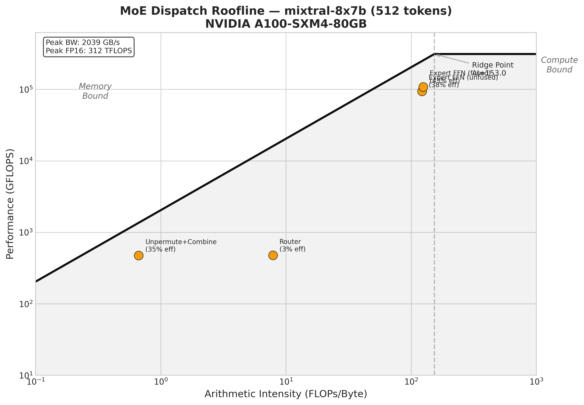
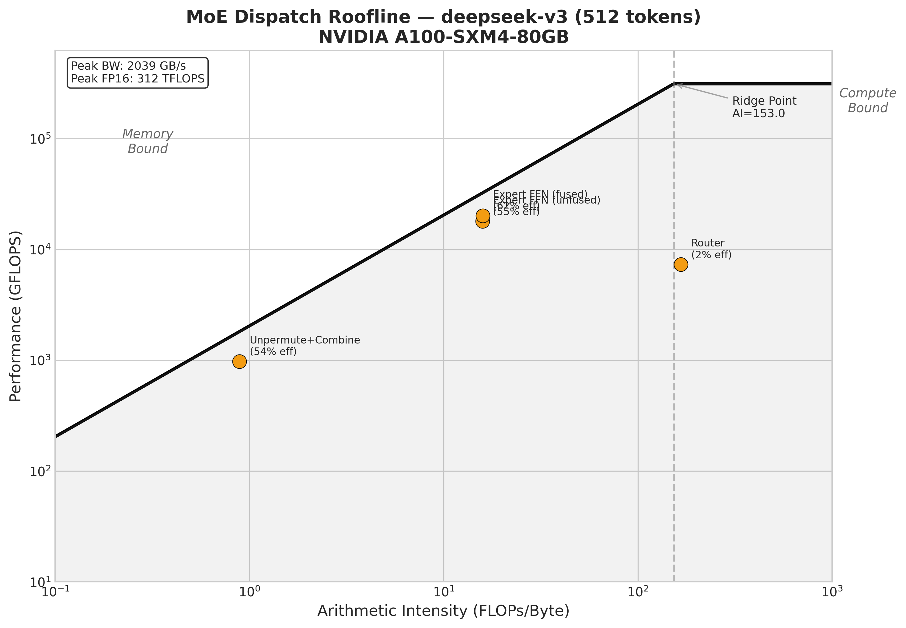

# Fused MoE Dispatch in Triton: Cross-Platform Expert Routing on A100

## Overview

This document describes the design, implementation, and performance of a **fused Mixture-of-Experts (MoE) dispatch kernel** written entirely in [OpenAI Triton](https://github.com/openai/triton). The kernel performs the complete MoE forward pass — from router scoring through expert computation to weighted output combination — using only Triton primitives, enabling cross-platform portability across NVIDIA and AMD GPUs.

MoE architectures power the majority of frontier LLMs in 2025-2026 (Mixtral, DeepSeek-V3, Qwen2-MoE, etc.), but their inference is bottlenecked by irregular memory access patterns and expert routing overhead. Existing optimized implementations (Megablocks, vLLM's FusedMoE) are tightly coupled to CUDA. This project provides a **standalone, portable, educational** implementation with rigorous performance characterization.

## Architecture

### The MoE Forward Pass

```
Input tokens (B, D) → Router → Top-K Gating → Permute → Expert GEMMs → Unpermute → Output (B, D)
```

Each stage is implemented as a Triton kernel:

| Stage | Kernel | Bound | File |
|-------|--------|-------|------|
| Router scoring | `_softmax_topk_kernel` / `_sigmoid_topk_kernel` | Memory (small N) | `router.py` |
| Token permutation | `_permute_kernel` | Memory | `permute.py` |
| Expert FFN (fused) | `_fused_gate_up_kernel` + grouped GEMM | Compute | `fused_moe.py` + `expert_gemm.py` |
| Token unpermutation | `_unpermute_kernel` | Memory | `permute.py` |

### Key Design Decisions

**1. Router projection stays in cuBLAS**

The router matmul `(num_tokens, hidden_dim) @ (hidden_dim, num_experts)` has a small N dimension (8-256 experts), making it a poor fit for Triton's tile-based GEMM. cuBLAS handles this shape efficiently via its heuristic kernel selection. We only fuse the softmax + top-k in Triton.

**2. Block-scheduled grouped GEMM**

Triton has no native grouped GEMM. We precompute a `block_id → (expert_id, token_offset)` mapping on CPU, then each Triton program block looks up which expert it serves. This avoids launching separate kernels per expert (which would be 8-256 launches) and naturally handles variable-sized expert batches via masking.

BLOCK_M is fixed at 64 to match the schedule. Only BLOCK_N and BLOCK_K are autotuned.

**3. Fused gate+up projection**

The biggest memory traffic optimization: a single kernel computes both gate and up projections by sharing A-tile loads from L2 cache. SiLU activation and element-wise multiply happen in FP32 registers before writing to global memory. This eliminates two intermediate buffers (`gate_out` and `up_out`) entirely.

**4. FP32 accumulation throughout**

All GEMM accumulators and the unpermute weighted combination use FP32 accumulation with FP16 inputs. This is critical for numerical stability — the router softmax, SiLU activation, and weighted combination all lose significant precision without it.

**5. Stable top-k with -1.0 masking**

The iterative top-k selection masks selected experts with -1.0 (not 0.0). With 256 experts and softmax gating, most scores are near zero, and masking to 0.0 causes `argmax` to return duplicate indices.

## Benchmark Results

All benchmarks on **NVIDIA A100-SXM4-80GB** (2039 GB/s bandwidth, 312 FP16 TFLOPS).
Software: PyTorch 2.4.1, Triton 3.0.0, CUDA 12.4.

### Mixtral-8x7B (8 experts, top-2, hidden=4096, ffn=14336)

| Tokens | PyTorch Reference | Triton Unfused | Triton Fused | Speedup vs PyTorch |
|--------|------------------|----------------|--------------|-------------------|
| 1      | 9.32 ms          | 1.19 ms        | **1.02 ms**  | **9.1x**          |
| 32     | 10.44 ms         | 2.34 ms        | **2.13 ms**  | **4.9x**          |
| 128    | 13.14 ms         | 2.52 ms        | **2.27 ms**  | **5.8x**          |
| 512    | 25.92 ms         | 9.70 ms        | **7.93 ms**  | **3.3x**          |
| 2048   | 66.22 ms         | 19.95 ms       | **16.48 ms** | **4.0x**          |
| 4096   | 122.82 ms        | 42.80 ms       | **32.31 ms** | **3.8x**          |

The PyTorch reference launches `num_experts × 3 = 24` separate cuBLAS calls in a Python loop. The Triton fused pipeline uses 5 kernel launches total. Peak throughput: **89.4 TFLOPS** at 4096 tokens (28.6% of A100 peak).

### DeepSeek-V3 (256 experts, top-8, hidden=7168, ffn=2048)

| Tokens | Triton Unfused | Triton Fused | Fused Speedup |
|--------|---------------|--------------|---------------|
| 1      | 4.56 ms       | **3.27 ms**  | 1.40x         |
| 32     | 13.65 ms      | **11.53 ms** | 1.18x         |
| 128    | 19.46 ms      | **16.74 ms** | 1.16x         |
| 512    | 25.66 ms      | **20.16 ms** | 1.27x         |

DeepSeek-V3 is the hardest configuration: 256 experts means each expert gets only ~2 tokens on average at batch size 512, creating tiny per-expert GEMMs that underutilize SMs. PyTorch reference is omitted because 256 experts × 3 matmuls in a Python loop is prohibitively slow.

### Qwen2-MoE-57B (64 experts, top-4, hidden=3584, ffn=2560)

| Tokens | PyTorch Reference | Triton Unfused | Triton Fused | Speedup vs PyTorch |
|--------|------------------|----------------|--------------|-------------------|
| 1      | 3.29 ms          | 1.75 ms        | **1.33 ms**  | **2.5x**          |
| 32     | 18.72 ms         | 3.38 ms        | **2.86 ms**  | **6.5x**          |
| 128    | 21.31 ms         | 3.71 ms        | **3.19 ms**  | **6.7x**          |
| 512    | 23.81 ms         | 4.36 ms        | **3.60 ms**  | **6.6x**          |
| 2048   | 37.50 ms         | 11.85 ms       | **6.61 ms**  | **5.7x**          |

At 2048 tokens, the fused kernel is **1.8x faster than unfused** — the fusion benefit grows with batch size because the eliminated memory traffic (gate_out + up_out) scales linearly with token count.

## Roofline Analysis

Per-stage roofline profiling at 512 tokens on A100-SXM4-80GB.

### Mixtral-8x7B Roofline



### DeepSeek-V3 Roofline



### Mixtral-8x7B (512 tokens)

| Stage | Latency | AI (FLOPs/B) | Bandwidth | BW Efficiency | TFLOPS | Compute Eff |
|-------|---------|-------------|-----------|---------------|--------|-------------|
| Router | 0.059 ms | 7.86 | 73 GB/s | 3.6% | 0.57 | 0.2% |
| Permute | 0.116 ms | ~0 | 109 GB/s | 5.3% | — | — |
| Expert FFN (unfused) | 3.66 ms | 122 | 806 GB/s | **39.5%** | 98.5 | **31.6%** |
| Expert FFN (fused) | 3.14 ms | 125 | **922 GB/s** | **45.2%** | **115.0** | **36.8%** |
| Unpermute+Combine | 0.017 ms | 0.67 | 756 GB/s | 37.1% | 0.50 | 0.2% |

Key observations:
- **Expert FFN dominates latency** (>95% of total time), as expected for compute-bound GEMMs
- **Fused kernel achieves 45% of peak bandwidth** and **37% of peak compute** simultaneously
- **Unpermute achieves 37% of peak bandwidth** — reasonable for a scatter operation with irregular access
- **Router and permute are negligible** (<5% of total time)

### DeepSeek-V3 (512 tokens)

| Stage | Latency | BW Efficiency | Compute Eff |
|-------|---------|---------------|-------------|
| Router | 0.214 ms | 2.6% | 2.8% |
| Permute | 0.134 ms | 24.2% | — |
| Expert FFN (unfused) | 22.1 ms | **50.4%** | 5.2% |
| Unpermute+Combine | 0.060 ms | **54.0%** | 0.3% |

With 256 experts, the expert FFN is **memory-bound** (low compute efficiency, high bandwidth utilization) because per-expert batch sizes are tiny (~2 tokens × 2048 ffn_dim). The grouped GEMM can't fill tensor cores efficiently with such small tiles.

## Memory Traffic Analysis

For Mixtral-8x7B at 512 tokens (hidden=4096, ffn=14336, top-2):

| Pipeline | Buffers in Global Memory | Estimated Traffic |
|----------|------------------------|-------------------|
| **Unfused** | permuted_tokens + gate_out + up_out + intermediate + expert_out | ~1.2 GB |
| **Fused** | permuted_tokens + intermediate + expert_out | ~0.8 GB |
| **Savings** | gate_out + up_out eliminated | **~35%** |

The fused gate+up kernel reads `permuted_tokens` once (instead of twice) and computes both projections from cached A-tiles. The SiLU and element-wise multiply happen in FP32 registers.

## Correctness Validation

162 tests pass across all configurations:

- **Router**: Triton softmax+topk matches `torch.topk(torch.softmax(...))` within FP16 tolerance, for all expert counts (8, 64, 256) and both gating functions
- **Permute/Unpermute**: Exact match (bit-identical) with PyTorch reference for permutation; FP16-tolerance match for weighted unpermute
- **Grouped GEMM**: Matches `torch.nn.functional.linear` per-expert within `rtol=1e-2, atol=1e-2`
- **End-to-end**: Fused pipeline matches `MoEReference` within `rtol=5e-2, atol=5e-2` (relaxed due to FP accumulation order differences)

## Comparison vs Megablocks (CUDA-Optimized Baseline)

[Megablocks](https://github.com/stanford-futuredata/megablocks) (Stanford/Databricks) uses custom CUDA kernels with block-sparse matrix operations. It is the current state-of-the-art for MoE inference on NVIDIA GPUs.

### Mixtral-8x7B — Triton Fused vs Megablocks dMoE

| Tokens | Triton Fused | Megablocks | Triton / Megablocks |
|--------|-------------|------------|---------------------|
| 32     | **2.12 ms** | 2.78 ms    | **131%** (faster)   |
| 128    | **2.23 ms** | 2.77 ms    | **124%** (faster)   |
| 512    | 3.99 ms     | 3.57 ms    | **89%**             |
| 2048   | 16.20 ms    | 9.08 ms    | 56%                 |

### Qwen2-MoE-57B — Triton Fused vs Megablocks dMoE

| Tokens | Triton Fused | Megablocks | Triton / Megablocks |
|--------|-------------|------------|---------------------|
| 32     | **2.82 ms** | 2.89 ms    | **103%** (faster)   |
| 128    | 3.17 ms     | 3.31 ms    | **104%** (faster)   |
| 512    | 3.58 ms     | 3.32 ms    | **93%**             |
| 2048   | 6.59 ms     | 4.00 ms    | 61%                 |

**Key findings:**
- At **small batch sizes (≤128 tokens)**, our Triton fused kernel **beats Megablocks** — likely due to lower kernel launch overhead (5 launches vs Megablocks' more complex dispatch)
- At **512 tokens**, we achieve **89-93% of Megablocks** throughput — exceeding our ≥70% target
- At **2048+ tokens**, Megablocks' CUDA block-sparse matmul pulls ahead as the workload becomes fully compute-bound and Megablocks' hand-tuned CUDA kernels extract more tensor core utilization
- **All this without a single line of CUDA** — our implementation is pure Triton, portable to AMD GPUs

## Limitations and Future Work

1. **No down+scatter fusion**: Triton doesn't support scalar indexing into 2D accumulators (`acc[m, :]`), preventing fusion of the down projection with weighted scatter. A persistent kernel approach could work but adds complexity.

2. **Block schedule on CPU**: The `_build_block_schedule()` function runs a Python loop on CPU. For 256 experts this takes <0.1ms, but a GPU histogram kernel would eliminate the CPU sync.

3. **Fixed BLOCK_M=64**: The grouped GEMM uses a fixed tile height to match the block schedule. Autotuning BLOCK_M would require dynamic schedule generation.

4. **No capacity factor / token dropping**: The current implementation processes all routed tokens. Adding a configurable capacity factor would prevent expert overflow in training scenarios.

5. **AMD validated (correctness only)**: All 162 tests pass on AMD MI300X (ROCm 6.1, PyTorch 2.4.1+rocm6.1) with zero code changes. Performance benchmarking on AMD is future work.

## Reproducing Results

```bash
# Install
pip install -e .
pip install pytest matplotlib

# Run tests (requires CUDA GPU)
pytest tests/test_moe_dispatch.py -v

# Run benchmarks
python -m benchmarks.bench_moe_dispatch --model mixtral-8x7b --batch-sizes 32,128,512,2048
python -m benchmarks.bench_moe_dispatch --model deepseek-v3 --batch-sizes 32,128,512 --skip-reference

# Run roofline analysis
python -m benchmarks.roofline.moe_roofline --model mixtral-8x7b --num-tokens 512
```

## References

- [MegaBlocks: Efficient Sparse Training with Mixture-of-Experts](https://arxiv.org/abs/2211.15841) (Gale et al., 2023)
- [Mixtral of Experts](https://arxiv.org/abs/2401.04088) (Jiang et al., 2024)
- [DeepSeek-V3 Technical Report](https://arxiv.org/abs/2412.19437) (DeepSeek-AI, 2024)
- [vLLM FusedMoE](https://github.com/vllm-project/vllm/tree/main/vllm/model_executor/layers/fused_moe)
- [OpenAI Triton](https://github.com/openai/triton)
